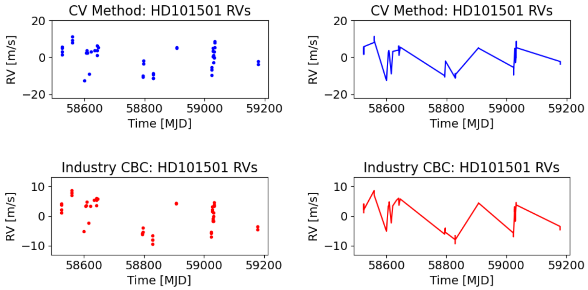

# A Computer Vision Approach to Radial Velocity Extraction for Exoplanet Detection 
* 2nd Place in OpenCV AI Competition 2023: https://www.hackster.io/contests/opencv-ai-competition-2023
* Tutorial on hackster.io: https://www.hackster.io/katelyngan77/opencv-for-exoplanet-detection-75d9ed
Demonstration Code  © 2023-2024 Katelyn Gan (katelyngan77@gmail.com) 
HD101501 data set is provided by Yale EXPRES, the EXtreme PREcision SPectrograph.
Description: This code demonstrates the concept and procedures of applying Computer Vision techniques to analyze stellar spectra and extract Radial Velocities (RV) for exoplanet detection. 

How to run the demonstration: With all the data files in place, run "CV_Approach_for_RV_Extraction_Code_Demo.py".

Code output: 

 

**********************************************************************************************************************

                  A Computer Vision Approach to Radial Velocity Extraction for Exoplanet Detection                  
                                                     Demo Code                                

**********************************************************************************************************************

Set up directories:
Directories were created successfully at path: 
101501

Directories were created successfully at path: 
RV//

Directories were created successfully at path: 
101501//ChunkSelectionImg

Directories were created successfully at path: 
101501//RawSpectrumImg

**************** Step 1: Calculate the average spectrum and save data to a pickle file *******************************
Working on Order #40
Working on Order #41
Working on Order #42
Working on Order #43
Working on Order #44
Working on Order #45
Working on Order #46
Working on Order #47
Working on Order #48
Working on Order #49
Working on Order #50
Working on Order #51
Working on Order #52
Working on Order #53
Working on Order #54
Working on Order #55
Working on Order #56
Working on Order #57
Working on Order #58
Working on Order #59
Working on Order #60

************* Step 2: Find all good absorption lines of the average spectra and save the data  *********************
Directories were created successfully at path: 
101501//ChunkSelectionImg//v2.4_ao4_nMin40_nMax60_cutoff0.75_widthMax48_heightMin0.3//

Working on Order #40 
Working on Order #41 
Working on Order #42 
Working on Order #43 
Working on Order #44 
Working on Order #45 
Working on Order #46 
Working on Order #47 
Working on Order #48 
Working on Order #49 
Working on Order #50 
Working on Order #51 
Working on Order #52 
Working on Order #53 
Working on Order #54 
Working on Order #55 
Working on Order #56 
Working on Order #57 
Working on Order #58 
Working on Order #59 
Working on Order #60 

************** Step 3: Generate raw average spectrum and individual spectrum images for good lines *****************
AvgSpectrum = AvgSpectrum_with_Chunks_ao4_nMin40_nMax60_cutoff0.75_widthMax48_heightMin0.3_2.4, w_oversampling = 2
Directories were created successfully at path: 
101501//RawSpectrumImg//AvgSpectrum_with_Chunks_ao4_nMin40_nMax60_cutoff0.75_widthMax48_heightMin0.3_2.4_v100_w_OS2_uncrtyFalse_grayscale//

Working on Order #40
Working on Order #41
Working on Order #42
Working on Order #43
Working on Order #44
Working on Order #45
Working on Order #46
Working on Order #47
Working on Order #48
Working on Order #49
Working on Order #50
Working on Order #51
Working on Order #52
Working on Order #53
Working on Order #54
Working on Order #55
Working on Order #56
Working on Order #57
Working on Order #58
Working on Order #59
Working on Order #60

************* Step 4: Apply enhancement, calculate shift on all good lines, and save the data  *********************
n_start=40, n_stop=60, chunk_file=AvgSpectrum_with_Chunks_ao4_nMin40_nMax60_cutoff0.75_widthMax48_heightMin0.3_2.4, WO=2, g_threshold=1
Directories were created successfully at path: 
RV//101501//AvgSpectrum_with_Chunks_ao4_nMin40_nMax60_cutoff0.75_widthMax48_heightMin0.3_2.4

Working on fits file #0 - 101501_190210.1141.fits...
Working on fits file #1 - 101501_190210.1153.fits...
Working on fits file #2 - 101501_190210.1154.fits...
Working on fits file #3 - 101501_190210.1155.fits...
Working on fits file #4 - 101501_190317.1083.fits...
Working on fits file #5 - 101501_190317.1084.fits...
Working on fits file #6 - 101501_190317.1085.fits...
Working on fits file #7 - 101501_190427.1068.fits...
Working on fits file #8 - 101501_190503.1087.fits...
Working on fits file #9 - 101501_190505.1069.fits...
Working on fits file #10 - 101501_190506.1076.fits...
Working on fits file #11 - 101501_190513.1121.fits...
Working on fits file #12 - 101501_190518.1122.fits...
Working on fits file #13 - 101501_190531.1107.fits...
Working on fits file #14 - 101501_190607.1069.fits...
Working on fits file #15 - 101501_190607.1070.fits...
Working on fits file #16 - 101501_190608.1082.fits...
Working on fits file #17 - 101501_190612.1068.fits...
Working on fits file #18 - 101501_191107.1170.fits...
Working on fits file #19 - 101501_191107.1171.fits...
Working on fits file #20 - 101501_191109.1267.fits...
Working on fits file #21 - 101501_191109.1268.fits...
Working on fits file #22 - 101501_191212.1139.fits...
Working on fits file #23 - 101501_191212.1140.fits...
Working on fits file #24 - 101501_191212.1141.fits...
Working on fits file #25 - 101501_191212.1142.fits...
Working on fits file #26 - 101501_200228.1094.fits...
Working on fits file #27 - 101501_200228.1095.fits...
Working on fits file #28 - 101501_200624.1066.fits...
Working on fits file #29 - 101501_200624.1067.fits...
Working on fits file #30 - 101501_200624.1068.fits...
Working on fits file #31 - 101501_200628.1090.fits...
Working on fits file #32 - 101501_200628.1091.fits...
Working on fits file #33 - 101501_200628.1092.fits...
Working on fits file #34 - 101501_200630.1093.fits...
Working on fits file #35 - 101501_200630.1094.fits...
Working on fits file #36 - 101501_200630.1096.fits...
Working on fits file #37 - 101501_200701.1071.fits...
Working on fits file #38 - 101501_200701.1072.fits...
Working on fits file #39 - 101501_200701.1073.fits...
Working on fits file #40 - 101501_200703.1070.fits...
Working on fits file #41 - 101501_200703.1071.fits...
Working on fits file #42 - 101501_200703.1072.fits...
Working on fits file #43 - 101501_201126.1070.fits...
Working on fits file #44 - 101501_201126.1071.fits...

************* Step 5: Calculate and plot RVs for all previously saved pickle files in a folder *********************
Directories were created successfully at path: 
RV//101501//AvgSpectrum_with_Chunks_ao4_nMin40_nMax60_cutoff0.75_widthMax48_heightMin0.3_2.4//RV_Plots

Pickle File = v100_w_OS2_uncrtyFalse_n40-60_LnGap[7, 11, 23, 37, 47]_gThrhld1_MTyp0_Loc0_discrt0.05_int200_fitsCnt45_CETrue.pickle
    RV (RMS) = 6.383050257148037

************** Step 6: Plot industry CBC method RVs ****************************************************************

******************** Step 7: Plot and compare Periodogram of both CV and industry methods **************************

Task Completed! Elapsed time: 145.618531 seconds
